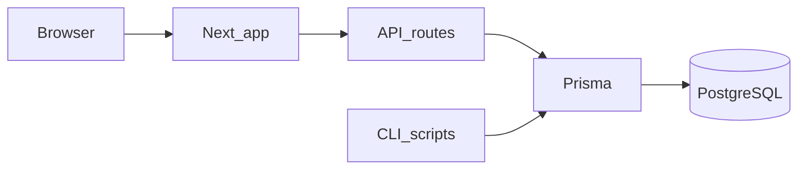

# Art Fold

**Art Fold** is a small web app to discover open-access and public-domain museum art, browse works from museum APIs, and curate a **six-work digital exhibition** with a shareable public URL.

Live site: [https://www.artfold.xyz](https://www.artfold.xyz)

The npm package name is **`art-fold`**; your local clone folder can be named however you like.

## Stack

- [Next.js](https://nextjs.org/) 15 (App Router), React 19, TypeScript
- [Prisma](https://www.prisma.io/) + PostgreSQL
- [Tailwind CSS](https://tailwindcss.com/)
- [Vercel](https://vercel.com/) for hosting; [`vercel.json`](vercel.json) sets the production `buildCommand` to `npm run build` (which runs `prisma generate` then `next build`)

## Repository layout

```
app/           Next.js routes, API handlers, layouts
components/    UI
lib/           App logic and lib/art-sources/ museum API clients
prisma/        schema.prisma and migrations
public/        Static assets; see note on llms.txt below
scripts/       CLI tools for the art pool (see scripts/README.md)
```

## Quick start

Prerequisites: **Node.js 20+** and **PostgreSQL** (hosted, e.g. [Neon](https://neon.tech), or local via Docker below).

```bash
cd /path/to/your-clone
cp .env.example .env
# Edit .env: set DATABASE_URL to your Postgres connection string

npm install
npx prisma migrate deploy
npm run dev
```

Open [http://localhost:3000](http://localhost:3000).

## Environment

Copy [.env.example](.env.example) to `.env` and set at least:

| Variable | Purpose |
|----------|---------|
| `DATABASE_URL` | Postgres connection string (required) |
| `NEXT_PUBLIC_APP_URL` | Public site URL for Open Graph / canonical links in production (optional locally) |
| `HARVARD_ART_API_KEY` | Optional; includes Harvard Art Museums in the random card mix ([API info](https://harvardartmuseums.org/collections/api)) |

Other optional keys and pool-tuning variables are documented in `.env.example`.

**Approximate pool sizes** (sanity-check museum coverage):

```bash
npm run art-pools
```

Set `HARVARD_ART_API_KEY` in the environment if you want Harvard included in that output.

## Deploy (Vercel)

1. Import this repo in Vercel and set **Environment variables** (at minimum `DATABASE_URL`, and `NEXT_PUBLIC_APP_URL` to your live URL once you know it).
2. **Schema migrations** are not run automatically by `vercel.json` today. Apply them to the **same** database Vercel uses, for example from your machine with production credentials:

   ```bash
   DATABASE_URL="postgresql://…production…" npx prisma migrate deploy
   ```

   (Or wire a build step / migration workflow you prefer; the app expects an up-to-date schema.)

3. After the first deploy, set `NEXT_PUBLIC_APP_URL` to the deployed URL (including `https://`) and redeploy so share previews use the correct domain.

Optional: add `HARVARD_ART_API_KEY` in Vercel if you use Harvard in production. Never commit real secrets to git.

## Database with Docker (optional)

If you use [Docker](https://www.docker.com/products/docker-desktop/):

```bash
docker compose up -d
```

Set `DATABASE_URL` in `.env` to match [`.env.example`](.env.example) (local `postgres` / `digital_exhibit`), then `npx prisma migrate deploy` and `npm run dev`.

## Art pool (optional)

The random deck and exhibits use `ArtPoolEntry` rows filled from museum APIs. npm scripts are prefixed with `art-pool:`; entry point is typically `npm run art-pool:build`. See [scripts/README.md](scripts/README.md) and [.env.example](.env.example).

## Architecture (high level)



## Other files

| File | Purpose |
|------|---------|
| [public/llms.txt](public/llms.txt) | Short site summary and URLs for LLM crawlers (common convention; not required to run the app) |

## Contributing

This is a personal project; contributions are not expected. See [CONTRIBUTING.md](CONTRIBUTING.md).
