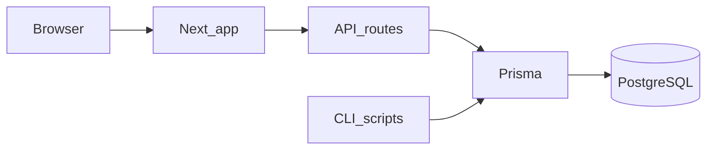

# Art Fold

**Art Fold** is a small web app to discover open-access and public-domain museum art, browse works from museum APIs, and curate a **six-work digital exhibition** with a shareable public URL.

Live site: [https://www.artfold.xyz](https://www.artfold.xyz)

This repository’s folder and npm package name are `digital-exhibit`; **Art Fold** is the product name shown on the site.

## Stack

- [Next.js](https://nextjs.org/) 15 (App Router), React 19, TypeScript
- [Prisma](https://www.prisma.io/) + PostgreSQL
- [Tailwind CSS](https://tailwindcss.com/)
- Deployed with [Vercel](https://vercel.com/) (`vercel.json` runs `prisma migrate deploy` on build)

## Quick start

Prerequisites: **Node.js 20+** and a **PostgreSQL** database (local Docker, [Neon](https://neon.tech), etc.).

```bash
cd /path/to/digital-exhibit
cp .env.example .env
# Edit .env: set DATABASE_URL to your Postgres connection string

npm install
npx prisma migrate deploy
npm run dev
```

Open [http://localhost:3000](http://localhost:3000).

For a **step-by-step setup** (including first-time Terminal use on a Mac), see **[SETUP.md](./SETUP.md)**.

## Art pool (optional)

The random card deck and exhibits use rows in Postgres built from museum APIs. See `package.json` scripts prefixed with `art-pool:` (for example `npm run art-pool:build`). Some sources need API keys or optional tuning via environment variables—see [.env.example](./.env.example).

## Architecture (high level)



## Docs

| File | Purpose |
|------|--------|
| [SETUP.md](./SETUP.md) | Full local setup and optional deploy notes |
| [public/llms.txt](./public/llms.txt) | Short site summary and key URLs |
